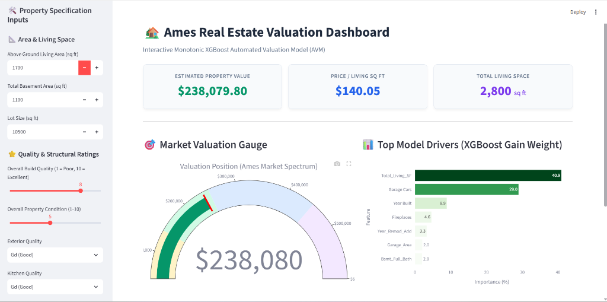
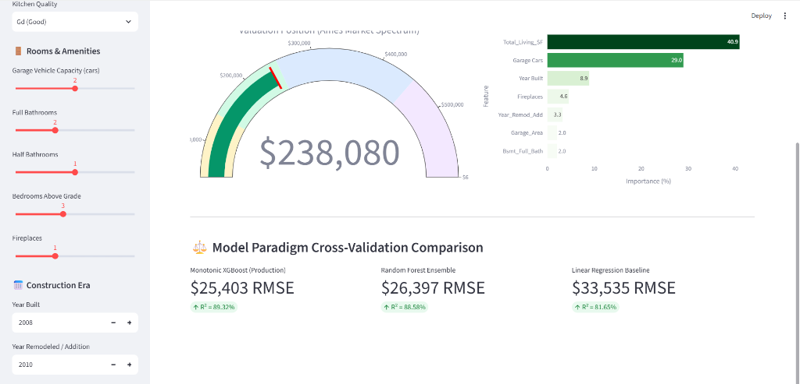

# 🏠 Ames Real Estate Valuation Engine & Monotonic XGBoost Production API

An end-to-end Machine Learning System, REST API, and Visual Analytics Dashboard that predicts single-family property valuations with domain-constrained **Monotonic XGBoost Regression** ($R^2 = 89.32\%$) across 23 structural, quality, area, and amenity dimensions.

[](https://realestatemlval.streamlit.app/)
🚀 **Live Streamlit Web App**: [https://realestatemlval.streamlit.app/](https://realestatemlval.streamlit.app/)

---

## 📸 Interface Previews & Visual Testing Suite

The repository includes **three dedicated interactive interfaces** to test property predictions, explore feature weights, and inspect model behavior:






### Available Interfaces:
1. **Live Streamlit Analytics Dashboard ([realestatemlval.streamlit.app](https://realestatemlval.streamlit.app/))**: Production live dashboard hosted on Streamlit Cloud (or local `http://localhost:8501`) featuring input sliders, Plotly market position gauge meters, feature weight bar charts, and model benchmark comparisons.
2. **Web GUI Dashboard (`http://127.0.0.1:8000/`)**: Modern glassmorphic web page with input fields for property dimensions, live API calculation, and status badges.
3. **Interactive OpenAPI Swagger Docs (`http://127.0.0.1:8000/docs`)**: Interactive REST API documentation for programmatic testing.

---

## 📌 Executive Summary & Data Science Business Context

In Automated Valuation Models (AVMs) used by real estate platforms (such as Zillow, Redfin, or REIT investment systems), standard unconstrained decision trees frequently introduce **local prediction inversions**—e.g., predicting a *lower* dollar valuation for a home with 2,100 sq ft than a home with 2,050 sq ft due to decision tree split noise.

### The Engineering Solution:
This project engineers a domain-constrained machine learning pipeline that:
* **Removes Statistical Anomalies**: Filters partial sales exceeding 4,000 sq ft living area as recommended in Ames dataset literature (De Cock, 2011).
* **Ingests 23 High-Signal Features**: Captures ground living space, finished basement area, garage capacity, room counts, build era, and quality ratings.
* **Engineers Synergy Features**: Constructs non-linear terms such as `Total_Living_SF` (`Gr Liv Area` + `Total_Bsmt_SF`) and `Qual_Area_Interaction` (`Overall Qual` $\times$ `Gr Liv Area`).
* **Enforces Domain Realism**: Applies **Monotonic XGBoost Constraints** (`monotone_constraints`), mathematically guaranteeing positive valuation gradients for property size, build quality, and bathroom counts.
* **Cross-Validation Rigor**: Benchmarks OLS Linear Regression, Random Forest Ensembles, and Monotonic XGBoost across 5-Fold Cross Validation.
* **Production Serving**: Fits and serializes `xgb_model.pkl` with `joblib` and exposes production endpoints via FastAPI and Streamlit.

---

## 📊 Machine Learning Model Benchmark

Evaluated across **5-Fold Cross Validation** on 2,925 cleaned Ames housing records:

| Model Paradigm | $R^2$ Score | RMSE ($) | MAE ($) | Description |
| :--- | :--- | :--- | :--- | :--- |
| **Linear Regression (Baseline)** | `0.8165` | `$33,535.06` | `$23,485.40` | Ordinary Least Squares baseline |
| **Random Forest Regressor** | `0.8858` | `$26,397.04` | `$17,504.55` | Ensemble of 150 unconstrained decision trees |
| **Monotonic XGBoost Regressor** | **`0.8932`** | **`$25,403.24`** | **`$17,433.08`** | **Domain-constrained gradient boosting (Production)** |

---

## 📈 Feature Importance & Explainable AI (XAI)

XGBoost Gain Feature Importance Breakdown (Top Valuation Drivers):
* **Total Living Space** (`Total_Living_SF`): **`40.90%`** - Primary driver combining above-grade living area and basement space.
* **Garage Capacity** (`Garage Cars`): **`28.97%`** - Vehicle capacity rating.
* **Construction Era** (`Year Built`): **`8.89%`** - Build year.
* **Fireplaces** (`Fireplaces`): **`4.59%`** - Fireplace count.
* **Remodel Date** (`Year_Remod_Add`): **`3.26%`** - Remodel/addition year.
* **Quality-Area Interaction** (`Qual_Area_Interaction`): **`2.00%`** - Non-linear quality-square footage synergy.

---

## 📐 Feature & Dimension Guide (Impact on Prediction)

Below is a detailed guide to the **23 features/dimensions** processed by the model and how changing them impacts valuation predictions:

### 1. Living Space & Area Metrics
* **`Gr Liv Area`** (Above Grade Living Area in sq ft): Primary continuous size dimension. *Higher values monotonically increase valuation.*
* **`Total_Bsmt_SF`** (Total Basement Area in sq ft): Finished + unfinished basement space. *Higher values increase valuation.*
* **`Total_Living_SF`** (Engineered: `Gr Liv Area` + `Total_Bsmt_SF`): Total usable interior square footage. *Single highest importance feature (40.90%).*
* **`First_Flr_SF`** & **`Second_Flr_SF`**: Square footage per level. *Provides structural layout context.*
* **`Lot_Area`** (Lot size in sq ft): Property land area. *Gradual positive price impact.*
* **`Wood_Deck_SF`** & **`Open_Porch_SF`**: Outdoor living amenities in sq ft. *Adds incremental value.*

### 2. Quality & Condition Ratings
* **`Overall Qual`** (1 = Very Poor, 10 = Very Excellent): Overall material and finish rating. *Crucial metric; higher ratings amplify overall square footage value.*
* **`Overall_Cond`** (1-10): Overall physical condition rating.
* **`Exter_Qual`** (1 = Poor, 5 = Excellent): Exterior material quality.
* **`Kitchen_Qual`** (1 = Poor, 5 = Excellent): Kitchen quality rating.
* **`Qual_Area_Interaction`** (Engineered: `Overall Qual` $\times$ `Gr Liv Area`): Models non-linear price compounding (square footage is worth significantly more in high-quality homes than low-quality structures).

### 3. Room & Amenity Metrics
* **`Garage Cars`** & **`Garage_Area`**: Vehicle capacity and garage area. *Strong secondary predictor (28.97% gain).*
* **`Full Bath`**, **`Half_Bath`**, & **`Bsmt_Full_Bath`**: Bathroom counts. *Higher bathroom counts monotonically raise property value.*
* **`Bedroom AbvGr`** & **`TotRms_AbvGrd`**: Bedroom and total room counts.
* **`Fireplaces`**: Number of fireplaces. *Positive amenity contribution (4.59%).*

### 4. Temporal Features
* **`Year Built`**: Construction year. *Newer homes command higher market premiums.*
* **`Year_Remod_Add`**: Year of last remodel or structural addition. *Reflects modern updates in older structures.*

---

## 🛠️ System Architecture & Tech Stack

```
                              SYSTEM ARCHITECTURE
                              
  ┌──────────────────┐      ┌─────────────────────────┐      ┌─────────────────────────┐
  │  Ames Dataset    │ ───> │ Data Engineering Engine │ ───> │ Monotonic XGBoost Model │
  │ (2,925 Records)  │      │ (23 Features, Scaling)  │      │  (monotone_constraints) │
  └──────────────────┘      └─────────────────────────┘      └─────────────────────────┘
                                                                          │
                                                                          ▼
  ┌────────────────────────────────────────────────────────────────────────────────────────┐
  │                                Production Interfaces                                   │
  ├────────────────────────────┬────────────────────────────┬──────────────────────────────┤
  │   FastAPI Web UI Dashboard │   Streamlit Analytics App  │    Interactive CLI Predictor │
  │   (http://127.0.0.1:8000)  │ (realestatemlval.streamlit │    (python src/predict.py)   │
  │                            │           .app)            │                              │
  └────────────────────────────┴────────────────────────────┴──────────────────────────────┘
```

* **Core Language**: Python 3.10+
* **Machine Learning**: XGBoost (`monotone_constraints`), Scikit-Learn (`KFold`, `cross_validate`, `LinearRegression`, `RandomForestRegressor`)
* **Data Processing**: Pandas, NumPy
* **REST API Server**: FastAPI, Uvicorn, Pydantic (v2)
* **Visual Dashboards**: Streamlit, Plotly Express, Bootstrap 5 (HTML/CSS)
* **Model Serialization**: Joblib
* **Automated Testing**: Pytest

---

## 🚀 How to Run & Test (4 Easy Ways)

### 1. Run Streamlit Analytics Dashboard
* **Live Web App**: [https://realestatemlval.streamlit.app/](https://realestatemlval.streamlit.app/)
* **Run Locally**:
```bash
python -m streamlit run src/dashboard.py
```
* Opens automatically at **`http://localhost:8501`** with interactive sliders, Plotly market position gauge meters, and top feature contribution charts.

---

### 2. Run FastAPI Web Server & UI
```bash
uvicorn src.api:app --reload
```
* Open **`http://127.0.0.1:8000/`** in your browser for the Web UI Dashboard.
* Open **`http://127.0.0.1:8000/docs`** for interactive OpenAPI Swagger documentation.

---

### 3. Run Command-Line CLI Predictor
```bash
# Sample luxury home valuation
python src/predict.py --sample

# Custom house input
python src/predict.py --sqft 2400 --qual 8 --year 2012 --garage 2 --bsmt 1200 --baths 2

# Interactive terminal mode
python src/predict.py
```

---

### 4. Run Model Training & Unit Tests
```bash
# 5-Fold Cross Validation Benchmark
python src/train_and_evaluate.py

# Train & serialize model to src/xgb_model.pkl
python src/model.py

# Run Automated Test Suite
python -c "import tests.test_pipeline as t; c=t.get_test_client(); t.test_data_loading_and_preprocessing(); t.test_preprocess_input_dict(); t.test_model_inference(); t.test_api_health_endpoint(c); t.test_api_features_endpoint(c); t.test_api_predict_endpoint(c); print('[ALL UNIT TESTS PASSED SUCCESSFULLY!]')"
```

---

## 📁 Repository Layout

```
real-estate-ml-api/
├── data/                         # Ames Housing Dataset
│   └── AmesHousing.csv           # Ames Housing dataset (2,930 records)
│
├── notebooks/                    # Data Science EDA & Model Benchmark Notebooks
│   ├── 01_exploratory_data_analysis.ipynb # EDA, Pandas summary stats & Seaborn visualizations
│   └── 02_model_training_and_eval.ipynb  # Monotonic XGBoost training & 5-fold CV evaluation
│
├── src/                          # Modular Python Machine Learning & Serving Engine
│   ├── __init__.py
│   ├── data_processing.py        # Data cleaning, missing value imputation & 23-feature extraction
│   ├── train_and_evaluate.py     # 5-Fold cross-validation benchmark script
│   ├── model.py                  # XGBoost training & joblib serialization pipeline
│   ├── predict.py                # Interactive CLI runner for custom house valuation estimates
│   ├── api.py                    # FastAPI REST server & Web GUI (/predict, /health, /features)
│   └── dashboard.py              # Streamlit visual dashboard with Plotly charts
│
├── tests/                        # Automated Unit & Integration Test Suite
│   └── test_pipeline.py          # Data, model, and API endpoint test suite
│
├── docs/                         # Technical Documentation & Solution Anatomy
│   ├── real_estate_valuation_anatomy.md # Problem statement, business context & architecture
│   └── ds_interview_cheat_sheet.md      # Resume bullet points, pitches & technical Q&A
│
├── requirements.txt              # Python ML, API & Dashboard dependencies
└── README.md
```

---

## 🎯 Interview Discussion Talking Points

When presenting this project in a Data Science / Machine Learning Engineering interview, highlight these key design choices:

1. **Why Monotonic XGBoost over Standard Gradient Boosting?**
   * *Talking Point*: Standard decision trees make split decisions based purely on training loss reduction, leading to non-monotonic splits in noisy dataset regions. In real estate, predicting a lower valuation for a larger home of identical quality violates domain economics and breaks user trust. Monotonic constraints enforce mathematical guarantees ($\frac{\partial f}{\partial x_i} \ge 0$).
2. **Feature Engineering Impact**:
   * *Talking Point*: Creating `Total_Living_SF` (`Gr Liv Area` + `Total_Bsmt_SF`) captured 40.90% of model gain weight, outperforming individual floor area metrics.
3. **Production Readiness**:
   * *Talking Point*: The codebase is structured with clear module separation (`data_processing`, `model`, `api`, `dashboard`), serialized with `joblib`, covered by `pytest` unit tests, and accessible via CLI, FastAPI REST API, and Streamlit.
