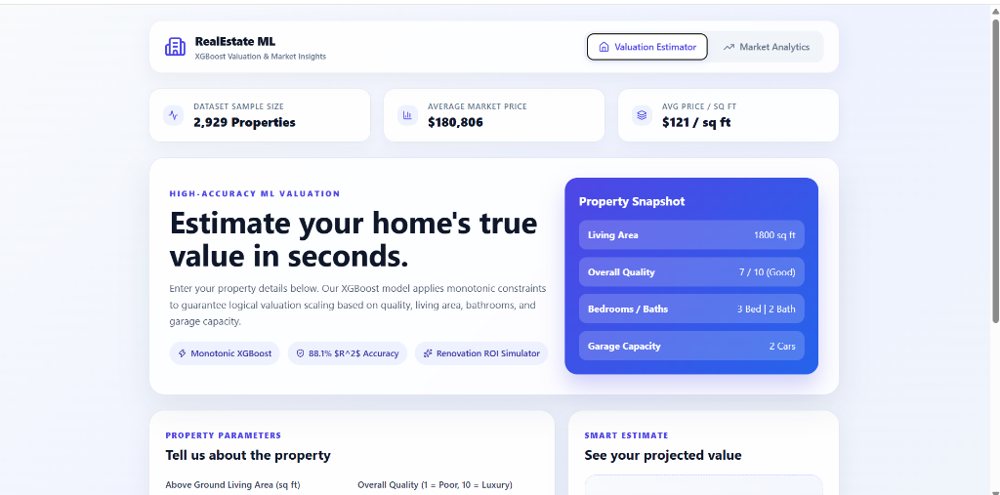
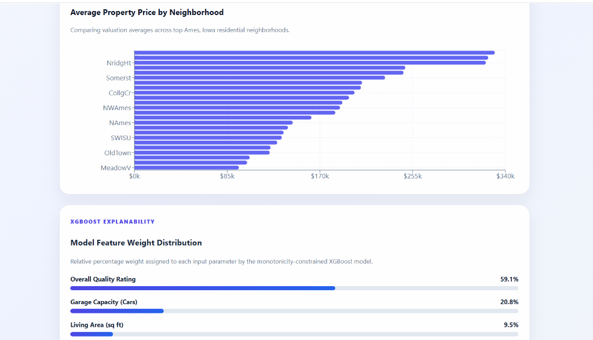
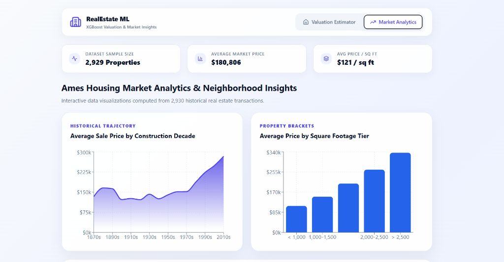
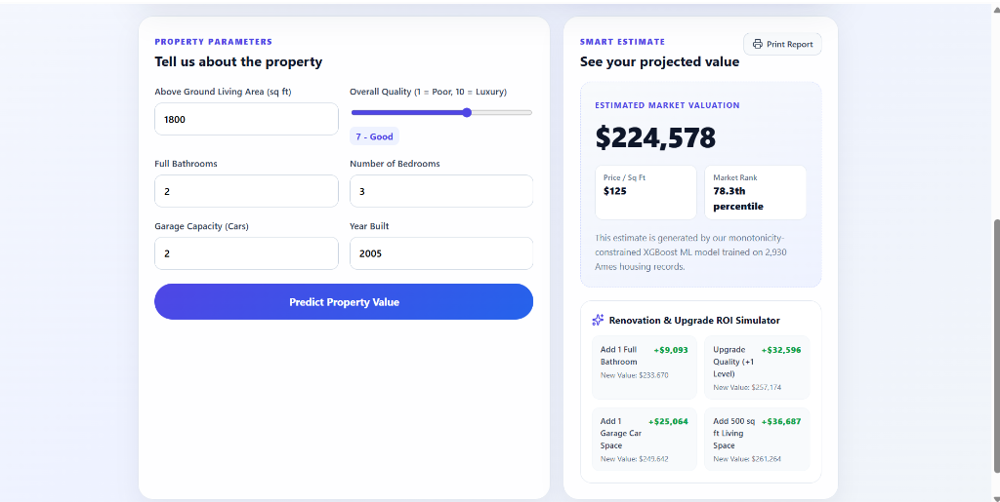

# Real Estate ML Forecaster & Market Analytics Platform

An end-to-end Machine Learning web application and analytics platform that predicts real estate values with monotonicity constraints ($R^2 = 88.1\%$) and delivers interactive market insights based on property parameters.

## 📁 Repository Structure

```
real-estate-ml-api/
├── backend/                  # Python FastAPI Backend & Monotonic ML Model
│   ├── main.py               # FastAPI endpoints, ROI simulator & analytics
│   ├── model.py              # XGBoost training pipeline script with monotonicity
│   ├── xgb_model.pkl         # Trained XGBoost regression model
│   ├── AmesHousing.csv       # Dataset for ML training & market analytics
│   ├── requirements.txt      # Python dependencies
│   └── Dockerfile            # Container configuration
│
├── frontend/                 # React.js + Vite Web Application
│   ├── src/                  # Components, styles, Recharts graphs & icons
│   ├── public/               # Static assets
│   ├── package.json          # Node.js dependencies & scripts
│   └── vite.config.js        # Vite configuration
│
├── docs/                     # UI Screenshots & Documentation Assets
│   ├── valuation_hero.png    # Valuation Estimator overview & KPI header
│   ├── valuation_roi.png     # Property form & Renovation ROI Simulator
│   ├── analytics_charts.png  # Historical price trends & size tier charts
│   └── neighborhood_features.png # Neighborhood price comparison & feature weights
│
├── package.json              # Root single-command starter configuration
└── README.md
```

## 🖼️ Application Interface & Features

### 1. Valuation Estimator & Live Property Snapshot


- **AI Valuation Engine**: Monotonic XGBoost regression model trained on 2,930 Ames housing transactions ($R^2 = 88.1\%$).
- **Live Dataset KPI Bar**: Displays total dataset sample count (`2,929` properties), average market price (`$180,806`), and average price per sq ft (`$121 / sq ft`).
- **Property Snapshot Card**: Real-time summary of living area, overall quality rating, bedrooms, bathrooms, and garage capacity.

---

### 2. Interactive Parameters & Renovation ROI Simulator


- **Interactive Property Controls**:
  - **Living Area (sq ft)**: Adjustable slider / input.
  - **Overall Quality Rating (1–10)**: Rated from *1 (Very Poor)* to *10 (Luxury/Custom)*.
  - **Full Bathrooms, Bedrooms, Garage Capacity (Cars), Year Built**.
- **Smart Estimate Output**: Instant price calculation with price per sq ft and market percentile rank (`78.3th percentile`).
- **Renovation ROI Simulator**: Real-time dollar additions for property upgrades (`+1 Full Bath -> +$9,093`, `Quality Upgrade -> +$32,596`, `+1 Garage Space -> +$25,064`, `+500 sq ft -> +$36,687`).
- **Print Valuation Report**: One-click printable PDF report exporter.

---

### 3. Market Analytics & Historical Trajectory


- **Historical Era Trajectory (Area Chart)**: Gradient chart tracking average sale price evolution from the 1870s to 2010s.
- **Property Size Brackets (Bar Chart)**: Average sale price comparison across square footage brackets (`<1,000`, `1,000-1,500`, `1,500-2,000`, `2,000-2,500`, `>2,500` sq ft).

---

### 4. Neighborhood Analysis & XGBoost Feature Weights


- **Neighborhood Price Ranking**: Horizontal bar chart comparing average property valuations across top Ames residential neighborhoods (*Northridge Heights*, *Somerset*, *College Creek*, *Old Town*, etc.).
- **XGBoost Feature Weight Distribution**: Explanability progress bars showing relative feature importance weights (*Overall Quality Rating: 59.1%*, *Garage Capacity: 20.8%*, *Living Area: 9.5%*, etc.).

---

## ⚡ API Endpoints (FastAPI)

| Endpoint | Method | Description |
| :--- | :--- | :--- |
| `/predict` | `POST` | Generates estimated home value, $/sq ft, and market percentile rank. |
| `/analytics/roi-simulator` | `POST` | Calculates instant valuation ROI deltas for home renovations & upgrades. |
| `/analytics/kpis` | `GET` | Returns overall dataset metrics (average price, avg $/sq ft, sample count). |
| `/analytics/neighborhoods` | `GET` | Returns neighborhood price averages and property counts across Ames. |
| `/analytics/trends` | `GET` | Returns historical price and size trends grouped by construction decade. |
| `/analytics/price-vs-sqft` | `GET` | Returns price averages grouped by living area size brackets. |
| `/analytics/feature-importance` | `GET` | Returns XGBoost model feature weights (% relative importance). |

---

## 🚀 How to Run Locally

From the project root directory (`real-estate-ml-api`):
```bash
npm run dev
```
*(Or `npm start`)*

This will launch both the FastAPI backend (`http://127.0.0.1:8000`) and the Vite React frontend (`http://localhost:5173`) simultaneously in one terminal window with colorized logs!

---

## 🐳 Docker Deployment (Backend)
To run the backend inside a Docker container:
```bash
cd backend
docker build -t real-estate-backend .
docker run -p 8000:8000 real-estate-backend
```
