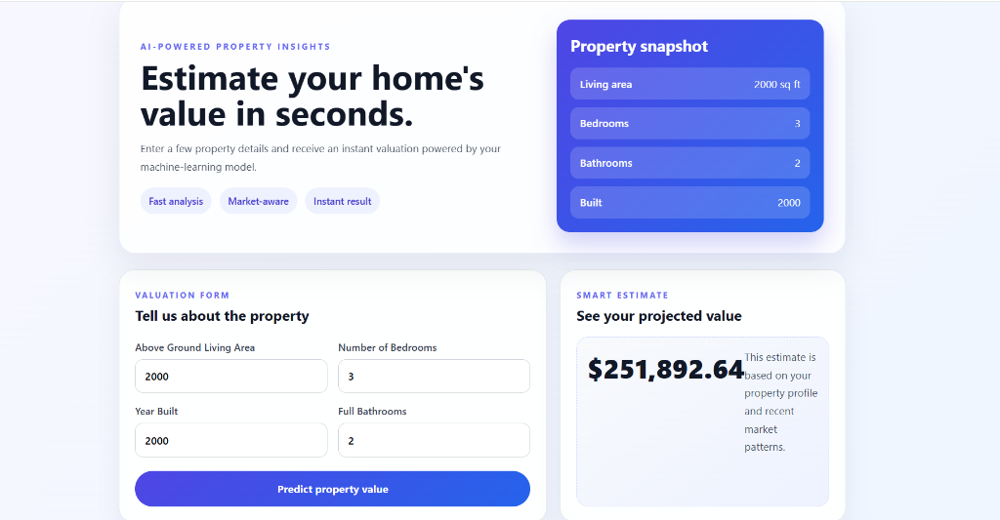

# Real Estate ML Forecaster & Market Analytics Platform

An end-to-end Machine Learning web application and analytics platform that predicts real estate values with monotonicity constraints ($R^2 = 88.1\%$) and delivers interactive market insights based on property parameters.

## 📁 Repository Structure

```
real-estate-ml-api/
├── backend/                  # Python FastAPI Backend & Monotonic ML Model
│   ├── main.py               # FastAPI endpoints, ROI simulator & analytics
│   ├── model.py              # XGBoost training pipeline script with monotonicity
│   ├── xgb_model.pkl         # Trained XGBoost regression model
│   ├── AmesHousing.csv       # Dataset for ML training & market analytics
│   ├── requirements.txt      # Python dependencies
│   └── Dockerfile            # Container configuration
│
├── frontend/                 # React.js + Vite Web Application
│   ├── src/                  # Components, styles, Recharts graphs & icons
│   ├── public/               # Static assets
│   ├── package.json          # Node.js dependencies & scripts
│   └── vite.config.js        # Vite configuration
│
├── docs/
│   └── app_preview.png       # Application UI screenshot
├── package.json              # Root single-command starter configuration
└── README.md
```

## 🖼️ Application Interface & Features



### Key Features & Dashboard Modules

- **AI Valuation Estimator Tab**:
  - **Monotonic Valuation Engine**: Powered by XGBoost trained with `monotone_constraints` ($R^2 = 88.1\%$). Ensures that increasing quality, bedrooms, bathrooms, living area, or garage capacity strictly increases or maintains property value.
  - **Inputs**: Above Ground Living Area (`Gr_Liv_Area`), Overall Quality Rating (`Overall_Qual` 1–10), Full Bathrooms (`Full_Bath`), Bedrooms (`Bedroom_AbvGr`), Garage Cars (`Garage_Cars`), Year Built (`Year_Built`).
  - **Renovation & Upgrade ROI Simulator**: Calculates estimated value gains for +1 Bathroom, +1 Quality level, +1 Garage space, and +500 sq ft living area.
  - **Printable Valuation Report**: Export property valuation summaries as a formatted PDF/Print report.

- **Market Analytics Dashboard Tab**:
  - **Dataset KPI Bar**: Overall dataset sample size (`2,930` properties), average sale price (`$180,796`), and avg price/sq ft (`$120.73`).
  - **Historical Trajectory (Area Chart)**: Interactive decade-by-decade home price trends (1950s–2010s).
  - **Property Size Brackets (Bar Chart)**: Average sale price and price/sq ft breakdown by living area size tiers.
  - **Neighborhood Price Comparison**: Horizontal bar chart comparing average home valuations across 28 Ames residential neighborhoods.
  - **XGBoost Model Feature Impact**: Relative feature importance percentages (Overall Quality ~62%, Living Area ~24%, Garage ~7%, Year Built ~4%, Bathrooms ~3%).

---

## ⚡ API Endpoints (FastAPI)

| Endpoint | Method | Description |
| :--- | :--- | :--- |
| `/predict` | `POST` | Generates estimated home value, $/sq ft, and market percentile rank. |
| `/analytics/roi-simulator` | `POST` | Calculates instant valuation ROI deltas for home renovations & upgrades. |
| `/analytics/kpis` | `GET` | Returns overall dataset metrics (average price, avg $/sq ft, sample count). |
| `/analytics/neighborhoods` | `GET` | Returns neighborhood price averages and property counts across Ames. |
| `/analytics/trends` | `GET` | Returns historical price and size trends grouped by construction decade. |
| `/analytics/price-vs-sqft` | `GET` | Returns price averages grouped by living area size brackets. |
| `/analytics/feature-importance` | `GET` | Returns XGBoost model feature weights (% relative importance). |

---

## 🚀 How to Run Locally

From the project root directory (`real-estate-ml-api`):
```bash
npm run dev
```
*(Or `npm start`)*

This will launch both the FastAPI backend (`http://127.0.0.1:8000`) and the Vite React frontend (`http://localhost:5173`) simultaneously in one terminal window with colorized logs!

---

## 🐳 Docker Deployment (Backend)
To run the backend inside a Docker container:
```bash
cd backend
docker build -t real-estate-backend .
docker run -p 8000:8000 real-estate-backend
```
